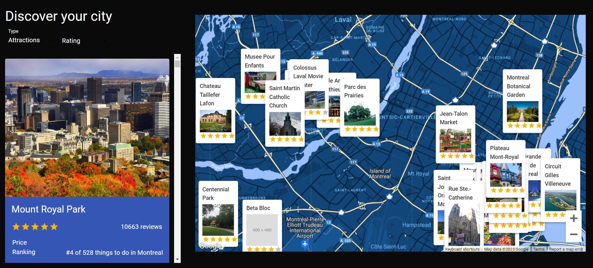

# Discover Ville



## Introduction
 Application fetching Google Maps api, restaurants, hotels and attractions api based on location from Rapid APIs.

- Search hotels
- Search restaurants
- Search attractions

## Installation

Clone the repository:

```bash
git clone https://github.com/ronaldmh/react-prj
```
Install dependencies:
```bash
npm install
```
Get a RapidAPI api key

[RapidAPI](https://rapidapi.com/hub?utm_source=youtube.com/JavaScriptMastery&utm_medium=DevRel&utm_campaign=DevRel)

Get a Google Map for javascript api key

[Maps JavaScript API](https://developers.google.com/maps/documentation/javascript/overview)


## API key usage 

```bash

## Travel Advisor API key

import axios from 'axios';

export const getPlacesData = async (type, sw, ne) => {
  try {
    const { data: { data } } = await axios.get(`https://travel-advisor.p.rapidapi.com/${type}/list-in-boundary`, {
      params: {
        bl_latitude: sw.lat,
        bl_longitude: sw.lng,
        tr_longitude: ne.lng,
        tr_latitude: ne.lat,
      },
      headers: {
        'X-RapidAPI-Key': #Your Key here! ,
        'X-RapidAPI-Host': 'travel-advisor.p.rapidapi.com',
      },
    });

    return data;
  } catch (error) {
    console.log(error);
  }
};

```

```bash

## Maps JavaScript API (Google)

<GoogleMapReact
        bootstrapURLKeys={{ key: #Your Key here! }}
        defaultCenter={coords}
        center={coords}
        defaultZoom={14}
        margin={[50, 50, 50, 50]}
        options={{ disableDefaultUI: true, zoomControl: true, styles: mapStyles }}
        onChange={(e) => {...


# Ready to start!

```

## Contribution

Contributions are welcome! If you'd like to contribute to this project, please follow these steps:

Fork the repository.

Create a new branch for your feature or bug fix: git checkout -b feature/your-feature-name.

Make your changes and commit them: git commit -m 'Add some feature'.

Push to the branch: git push origin feature/your-feature-name.

Create a pull request.

# End
